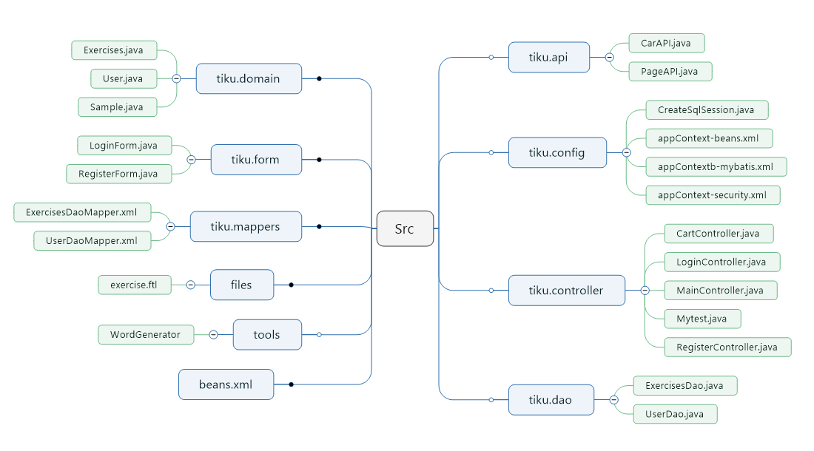

## 项目简介
* 本项目为Java试题管理系统，用于帮助教师收集Java试题，生成Java试卷

## 项目结构介绍  
* 项目基于以下相关技术：JSP,Spring,Mybatis,BootStrap,Ajax
* 项目目录

## JavaTiku有哪些功能？
* 方便的试题录入功能，输入题目描述，题目答案，并为该题目选择相应标签即可
* 强大的题目筛选功能，根据按难度，按知识点，按类型可随意筛选出自己想要的题目
* 快捷的导出试卷功能，选择心仪的试题添加进已选题目栏（类似购物车的想法）中，最后点击导出就可以导出一份Java试卷

## 部分界面展示
* 录题

* 选题界面

* 已选题目

* 导出的试卷样例
